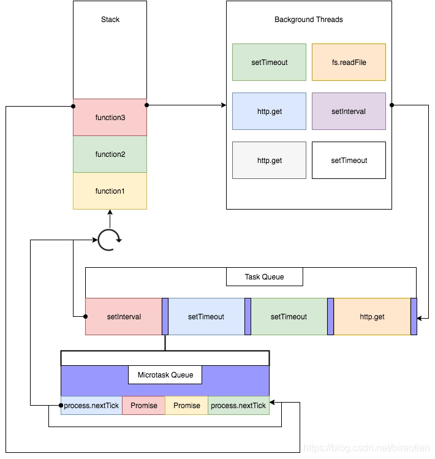

## **定时器** <Badge text="重点" />
定时器基于事件循环，基本应用于4种场景：  
- 计时器炸弹
- 闹钟
- 秒杀倒计时
- 轮播图
......  

### 一次性定时器
```js:no-line-numbers
setTimeout(callback,time,[...])
```
计划在xxx毫秒后执行一次回调函数`callback`,返回一个`timeObject`,供`clearTimeout`在需要的时候使用.    
```js:no-line-numbers
clearTimeout(timeObject)
```
清除一次性定时器

`DEMO` **一次性定时器**
```js
let timer = setTimeout(() => {
    console.log('Hello World');
}, 3000);

// console.log(timer);

//clearTimeout(timer) //清除一次性定时器
```

### 周期性定时器
```js:no-line-numbers
setInterval(callback,time,[...])
```
计划在xxx毫秒后执行一次回调函数`callback`(可重复执行回调),返回一个`intervalObject`,供`clearInterval`在需要的时候使用  
`clearInterval`(返回一个intervalObject) 清除周期性定时器  

`DEMO` **周期性定时器**
```js
// 如果对定时器不做条件限制,周期性定时器会一直执行下去
var count = 1;
let timer = setInterval(() => {
    console.log('Hello World');
    count++;
    if (count > 3) {
        //clearInterval(timer) //清除周期性定时器
        clearInterval(timer);
    }
}, 2000);
```

### 立即执行定时器 <Badge text="了解" />
立即执行定时器(控制代码执行顺序)

`DEMO` **立即执行定时器**
```js
// setImmediate 如果你想将一些异步的代码尽早的执行,那么可以使用此函数
setImmediate(() => {
    console.log('Hello World');
});

// 立即执行定时器(主要原因是上方的定时器比较拉胯,不太好用,有更加严格的调用规则)
process.nextTick(() => {
    console.log('Hello Nodejs');
});
```

### 事件循环 <Badge text="理解" />
  
  

事件的循环，分为6个阶段，每个阶段都有自己特殊的任务。
1. timers    给定时器制定一个执行的下限时间
2. 系统回调
3. prepare Node内部回调
4. poll(事件队列)
   - 如果存在setImmediate的设定,则事件循环结束后立即结束poll阶段进入check阶段
   - 如果不存在setImmediate的设定,则会查看是否有其他的定时器setTimeout或者setInterval,如果有有则事件循环绕会timers阶段执行,如果没有则阻塞在poll阶段中,等待回调
5. check 立即执行setImmediate
6. close callbakc 正常情况下几乎不会发生

### 倒计时 <Badge text="练习" />
:::tip 利用定时器(周期)完成倒计时功能  
**倒计时**: 在终端中打印出距离xx天xx时xx分xx秒结束秒杀活动

**任务分解**:
1. 确定定时器 → 周期。
2. 确定结束时间。
3. 不断的获取当前时间，并计算当前时间距离结束时间的时间差。
4. 如果时间到，清除定时器。
:::

```js
// 设定结束时间
var endTime = new Date('2022/3/28 20:43:00');
let timer = setInterval(() => {
    // 获取当前时间
    var nowTime = new Date();
    // 计算剩余时间 得到的是毫秒数, 需要换算秒 方便计算后续内容
    var lastTime = (endTime - nowTime) / 1000;

    // 如果lastTime小于0说明已经到时间,清除定时器
    if (lastTime > 0) {
        // 计算天 86400  
        let day = parseInt(lastTime / 24 / 60 / 60);
        // 计算小时 余数代表小时
        let hour = parseInt(lastTime / 60 / 60 % 24);
        // 计算分钟
        let min = parseInt(lastTime / 60 % 60);
        // 计算秒
        let sec = parseInt(lastTime % 60);
        // es6的模板化字符串输出
        console.log(`距离${day}天${hour}时${min}分${sec}秒结束秒杀活动`);
    } else {
        clearInterval(timer);
    } 
}, 1000);
```